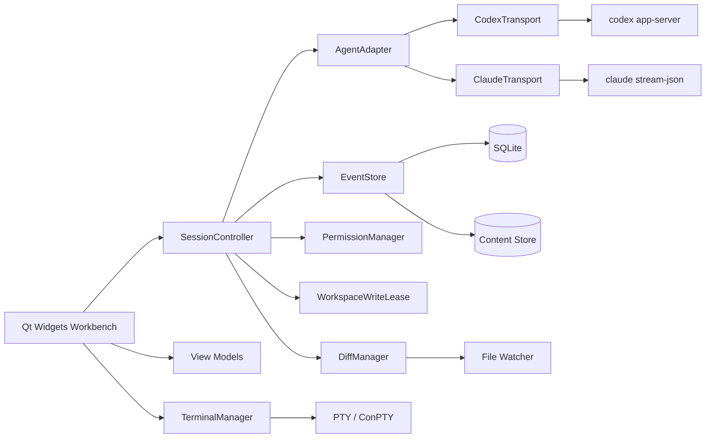
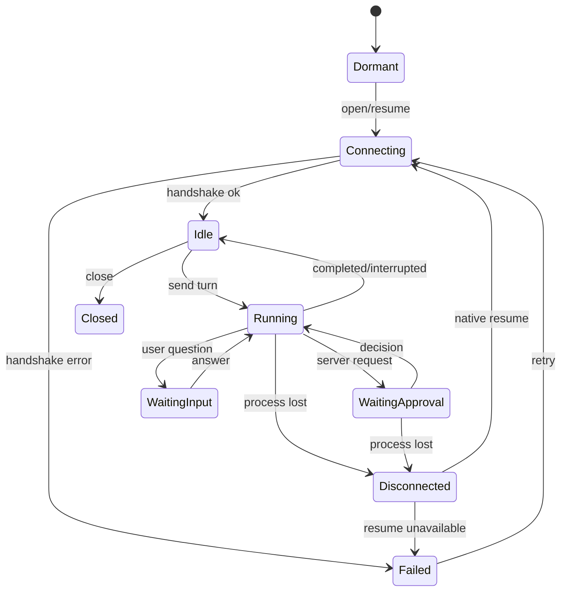

# System architecture

## 1. Technical baseline

C++20, Qt 6.8 LTS minimum, CMake, Qt Widgets for desktop chrome, Qt WebEngine/WebChannel for controlled rich text, SQLite for metadata, content-addressed storage for blobs, official structured agent protocols, and separate PTY/ConPTY user shells. Snack is one application process with multiple windows and global single-instance IPC.

## 2. Component view

## 3. Layers and modules

- `app`: startup, single-instance IPC, command-line routing, tray, window restore, crash markers, and migrations.
- `domain`: Widget-free types including `Conversation`, `AgentSession`, `Turn`, `AgentEvent`, `CapabilitySet`, `PermissionRequest`, `DiffSet`, `WorkspaceWriteLease`, and `QueuedMessage`. Native fields never leak into domain objects.
- `agent`: `IAgentAdapter`, `IAgentTransport`, `CodexAdapter`, `ClaudeAdapter`, and `AgentEventMapper`. Unsupported behavior returns `UnsupportedCapability`; the UI never guesses.
- `session`: one `SessionController` per conversation, serializing state transitions, active turns, queues, settings snapshots, approvals, native IDs, and recovery. `SessionRuntimeRegistry` owns each Agent runtime before its controller, rejects identity/type collisions, and closes controllers in reverse insertion order before destroying adapters or transports.
- `workspace`: canonical paths, ignore rules, symbol index, file watching, baselines, diffs, external-edit conflicts, and write leases.
- `storage`: append-oriented transactional `EventStore`, SHA-256 `ContentStore`, versioned migrations, and Repository interfaces.
- `ui`: `QMainWindow` and `QDockWidget`; at most one `QWebEnginePage` per visible conversation window; ViewModels own logic.
- `terminal`: a separate `TerminalManager` with Windows ConPTY and POSIX PTY backends. Scrollback stays in memory.

The current M2 slices implement `IProcessTransport`/`QProcessTransport`, `CodexCliDiscovery`, `CodexProtocol`, `CodexAppServerClient`, `CodexAccountLifecycle`, `CodexModelCatalog`, `CodexThreadLifecycle`, `CodexTurnLifecycle`, `CodexApprovalLifecycle`, `CodexUserInputLifecycle`, and the text/activity/approval/input turn state machine. `AgentRuntimeFactory` connects adapter and transport lifetime to the main application, selects Codex by default, and provides an explicit Mock fallback. The adapter validates authentication and completes model discovery before starting or resuming the native thread, builds each request from an immutable settings snapshot, and maps text, tool, reasoning-summary, plan, approval, user-input, usage, error, interrupt, and terminal events into common persisted events. `SessionController` persists both native identity fields, normalizes next-turn settings, publishes dynamic capabilities, and owns pending approval/input UI state. The common UI restores activity cards, unanswered question cards, token/context usage, and the task-plan dock without inspecting Codex-specific event names.

## 4. Concurrency model

- GUI thread: Widgets, WebEngine navigation, and small ViewModel updates.
- Agent transports: asynchronous framed I/O with bounded queues and coalesced UI updates.
- Storage: one serialized writer and independent read connections, batching event commits.
- Workspace: a bounded pool for indexing, hashing, snapshots, and diff computation.
- File watching: debounce into a per-workspace serial executor.
- Terminal: asynchronous I/O and bounded scroll buffers.

Qt objects cross threads only through queued connections or immutable values. Widgets, `QSqlDatabase` connections, and `QWebEnginePage` never move across owning threads.

## 5. Session state machine

Interruptions and process loss are persisted. Reconnection never automatically resends a request or queue.

M3 multi-session ownership begins at a Widget-free registry. The application entry point owns this registry through `SessionManager` instead of keeping a standalone runtime/controller pair, while windows and conversation rails receive non-owning controller pointers only. Removing a registry entry first drives an open controller to `Closed`, then destroys it, its adapter, and finally its transport; controllers already closed by a window shutdown are not closed twice. This boundary prevents an active controller from retaining a dangling Agent pointer and gives true exit one deterministic `closeAll()` path.

`SessionManager` is the application-layer opening boundary above the registry. It accepts a runtime factory, reuses an already-open compatible session, and creates a fresh runtime only for a closed historical conversation. Persisted historical status is normalized to `Dormant` before the fresh controller connects; stale `Idle` or `Running` values never imply that a newly created runtime is already connected. A fallback whose selected Agent type differs from the stored conversation is reported as unavailable rather than silently opening that conversation through another Agent.

New conversations use a separate `create` path. The requested Agent may explicitly fall back before any native identity exists; the resulting conversation records the runtime's actual Agent type and displays the fallback diagnostic. This does not weaken historical-session isolation.

## 6. WebEngine boundary

Load only packaged `qrc://` assets, reject remote subresources, parse Markdown into an AST and render through an allowlist, package Mermaid and math rendering offline, expose only copy/expand/measure/scroll/link requests through WebChannel, and validate external URLs in C++. A renderer crash rebuilds from `EventStore` without affecting the agent.

## 7. Testability

Processes, clocks, filesystems, keychains, notifications, window activation, and update checks are injected interfaces. Tests use fake transports, temporary directories and databases, deterministic clocks, and versioned protocol fixtures/schema contracts.

## 8. Dependencies

Prefer Qt and the standard library. Add only mature, license-compatible libraries for terminal emulation, diff/patch, cryptography/compression, or logging. Pin every dependency with `FetchContent`. Node.js, Python, and CDNs are not application runtime dependencies.
