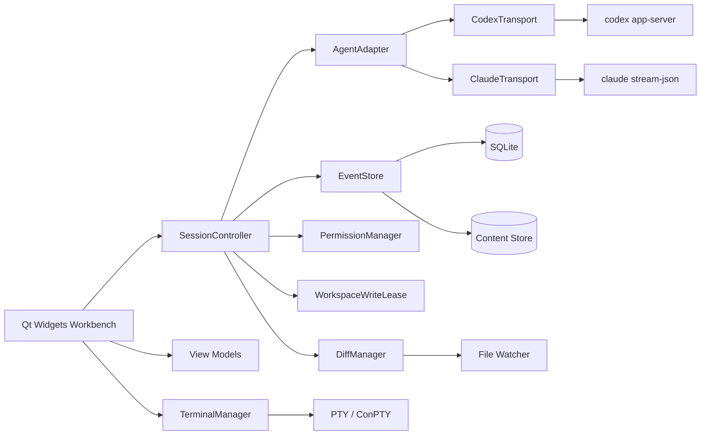
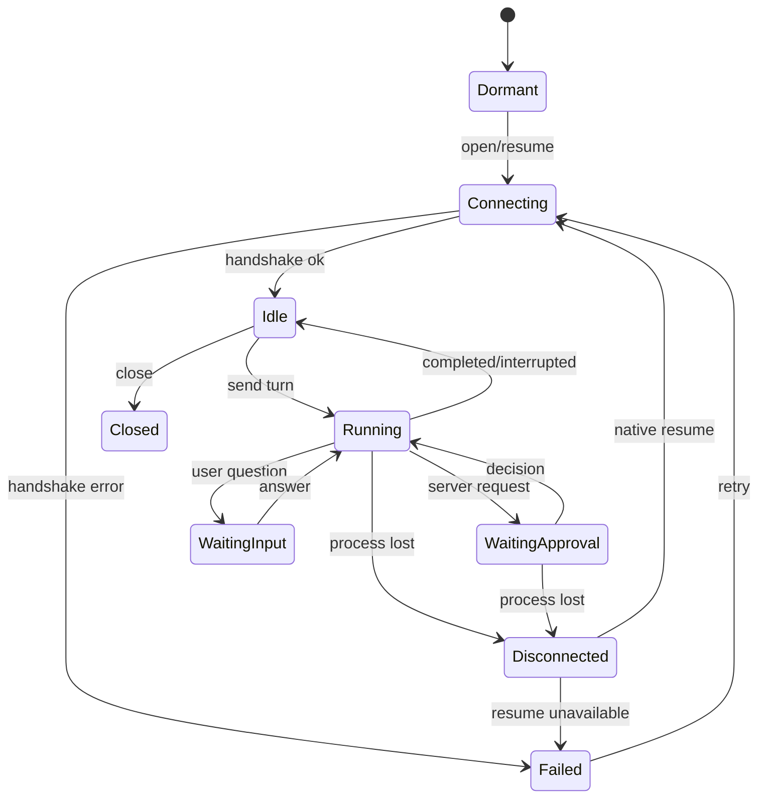

# System architecture

## 1. Technical baseline

C++20, Qt 6.8 LTS minimum, CMake, Qt Widgets for desktop chrome, Qt WebEngine/WebChannel for controlled rich text, SQLite for metadata, content-addressed storage for blobs, official structured agent protocols, and separate PTY/ConPTY user shells. Snack is one application process with multiple windows and global single-instance IPC.

## 2. Component view

## 3. Layers and modules

- `app`: startup, single-instance IPC, command-line routing, tray, window restore, crash markers, and migrations.
- `domain`: Widget-free types including `Conversation`, `AgentSession`, `Turn`, `AgentEvent`, `CapabilitySet`, `PermissionRequest`, `DiffSet`, `WorkspaceWriteLease`, and `QueuedMessage`. Native fields never leak into domain objects.
- `agent`: `IAgentAdapter`, `IAgentTransport`, `CodexAdapter`, `ClaudeAdapter`, and `AgentEventMapper`. Unsupported behavior returns `UnsupportedCapability`; the UI never guesses.
- `session`: one `SessionController` per conversation, serializing state transitions, active turns, queues, settings snapshots, approvals, native IDs, and recovery.
- `workspace`: canonical paths, ignore rules, symbol index, file watching, baselines, diffs, external-edit conflicts, and write leases.
- `storage`: append-oriented transactional `EventStore`, SHA-256 `ContentStore`, versioned migrations, and Repository interfaces.
- `ui`: `QMainWindow` and `QDockWidget`; at most one `QWebEnginePage` per visible conversation window; ViewModels own logic.
- `terminal`: a separate `TerminalManager` with Windows ConPTY and POSIX PTY backends. Scrollback stays in memory.

## 4. Concurrency model

- GUI thread: Widgets, WebEngine navigation, and small ViewModel updates.
- Agent transports: asynchronous framed I/O with bounded queues and coalesced UI updates.
- Storage: one serialized writer and independent read connections, batching event commits.
- Workspace: a bounded pool for indexing, hashing, snapshots, and diff computation.
- File watching: debounce into a per-workspace serial executor.
- Terminal: asynchronous I/O and bounded scroll buffers.

Qt objects cross threads only through queued connections or immutable values. Widgets, `QSqlDatabase` connections, and `QWebEnginePage` never move across owning threads.

## 5. Session state machine

Interruptions and process loss are persisted. Reconnection never automatically resends a request or queue.

## 6. WebEngine boundary

Load only packaged `qrc://` assets, reject remote subresources, parse Markdown into an AST and render through an allowlist, package Mermaid and math rendering offline, expose only copy/expand/measure/scroll/link requests through WebChannel, and validate external URLs in C++. A renderer crash rebuilds from `EventStore` without affecting the agent.

## 7. Testability

Processes, clocks, filesystems, keychains, notifications, window activation, and update checks are injected interfaces. Tests use fake transports, temporary directories and databases, deterministic clocks, and versioned protocol fixtures/schema contracts.

## 8. Dependencies

Prefer Qt and the standard library. Add only mature, license-compatible libraries for terminal emulation, diff/patch, cryptography/compression, or logging. Pin every dependency with `FetchContent`. Node.js, Python, and CDNs are not application runtime dependencies.
