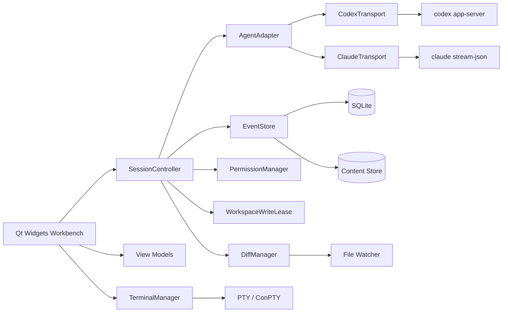
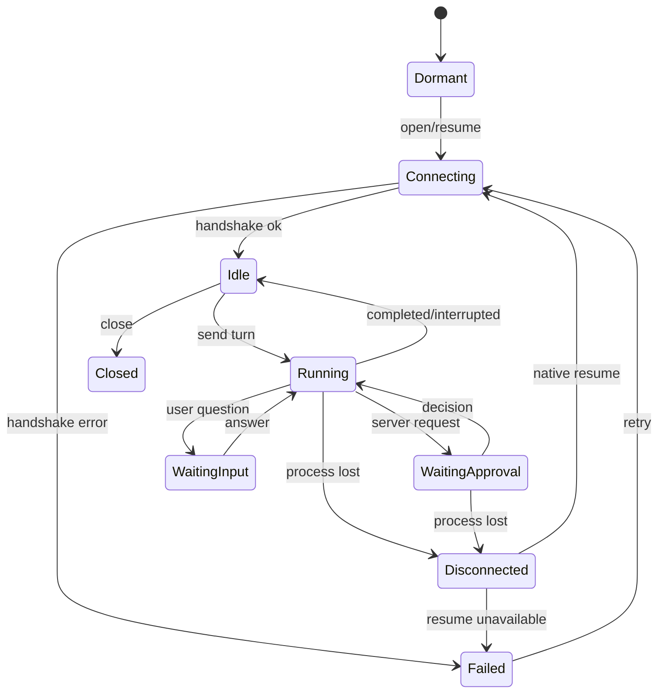

# 系统架构

## 1. 技术基线

- C++20，Qt 6.8 LTS 最低版本，CMake。
- Qt Widgets 负责桌面工作台；Qt WebEngine + WebChannel 负责受控富文本。
- Qt Sql/SQLite 负责元数据；大对象保存在内容寻址存储。
- Agent 使用官方结构化协议；用户 Shell 使用独立 PTY/ConPTY。
- 单一应用进程、多窗口、全局单实例。

## 2. 组件图

## 3. 分层与模块

### 3.1 `app`

负责启动、单实例 IPC、命令行参数、托盘、窗口恢复、崩溃标记与数据库迁移。`snack <directory>` 只向主实例发送经过校验的路径请求。

### 3.2 `domain`

包含无 Qt Widget 依赖的核心类型：`Conversation`、`AgentSession`、`Turn`、`AgentEvent`、`CapabilitySet`、`PermissionRequest`、`DiffSet`、`WorkspaceWriteLease`、`QueuedMessage`。领域对象不包含 Codex/Claude 原始字段。

### 3.3 `agent`

- `IAgentAdapter`：检测、能力、创建、恢复、发送、补充、取消、设置与关闭。
- `IAgentTransport`：进程生命周期、帧读写、请求关联、超时与背压。
- `CodexAdapter`：JSON-RPC/JSONL 与 app-server Schema。
- `ClaudeAdapter`：stream-json、session ID、能力事件与官方审批桥。
- `AgentEventMapper`：原生消息转换为统一领域事件。

适配器必须返回 `UnsupportedCapability`，不能让 UI 猜测 Agent 类型或降级方式。

M2 当前已实现 `IProcessTransport`/`QProcessTransport`、`CodexCliDiscovery`、`CodexProtocol`、`CodexAppServerClient`、`CodexAccountLifecycle`、`CodexModelCatalog`、`CodexThreadLifecycle`、`CodexTurnLifecycle`、`CodexApprovalLifecycle`、`CodexUserInputLifecycle` 和文本/活动/审批/提问 Turn 状态机。`AgentRuntimeFactory` 把适配器与传输的生命周期接入主应用，默认选择 Codex并提供显式 Mock 回退。适配器先校验认证状态，再完成全部模型分页并发布能力，然后创建或恢复服务端 Thread；每轮从不可变设置快照构造原生请求，并把文本、工具、推理摘要、计划、审批、用户提问、用量、错误、中断和终态映射为可持久化的统一事件。`SessionController` 分别持久化两个原生身份字段、归一化下一轮设置、向 UI 发布动态能力，并拥有待审批与待回答 UI 状态。公共 UI 无需识别 Codex 特有事件名，即可恢复活动卡片、未回答问题卡片、Token/上下文用量和任务计划 Dock。

### 3.4 `session`

`SessionController` 是单会话编排器。它维护运行状态、当前 Turn、消息队列、设置快照、审批、原生会话 ID与恢复策略。每个会话独立串行处理自身状态转换，不共享可变协议状态。`SessionRuntimeRegistry` 在 Controller 之前持有对应 Agent Runtime，拒绝会话身份或 Agent 类型冲突，并在销毁 Adapter/Transport 前按加入顺序的逆序关闭 Controller。

M3 多会话所有权从不依赖 Widget 的 Registry 开始。应用入口现在通过 `SessionManager` 持有 Registry，由它取代独立的 Runtime/Controller 对，窗口和会话栏只接收非拥有的 Controller 指针。移除记录时先把未关闭的 Controller 推到 `Closed`，随后依次销毁 Controller、Adapter 和 Transport；窗口关闭流程已经关闭的 Controller 不会被重复关闭。该边界避免活动 Controller 留下悬空 Agent 指针，也让真正退出统一走一条确定性的 `closeAll()` 路径。

永久删除使用独立生命周期边界。`SessionManager` 拒绝删除仍有 Agent 工作的会话，按所有权顺序关闭已打开的 Controller 与 Runtime，再请求 Repository 删除会话。SQLite 外键随父记录原子级联删除事件和排队消息；Repository 删除失败时尝试以原 Agent Runtime 恢复原会话，不留下悬空 Controller。

`SessionManager` 是 Registry 之上的应用层会话打开边界。它接收可替换的 Runtime Factory，复用已经打开且类型相容的会话，只为已关闭的历史会话创建新 Runtime。新 Controller 连接前会把持久化的历史状态归一为 `Dormant`，旧的 `Idle` 或 `Running` 值绝不代表新 Runtime 已经连接。如果回退后的 Agent 类型与已存会话不同，则明确报告不可用，绝不通过另一种 Agent 静默打开该会话。

新会话使用独立的 `create` 路径。因为此时尚不存在原生身份，请求的 Agent 可以先明确回退；最终会话记录 Runtime 实际选中的 Agent 类型并显示回退诊断。这不会放宽历史会话的 Agent 隔离。

归档只是元数据操作且不破坏历史。`SessionManager` 拒绝归档仍有 Agent 工作的会话；空闲会话先持久化归档标记，再关闭 Runtime，但不删除事件、队列、草稿或原生身份。恢复会先验证并创建严格匹配的历史 Agent Runtime；只有能够建立拥有型 Controller 时才清除归档标记，因此 Agent 不可用时条目仍保持归档。

### 3.5 `workspace`

负责路径规范化、忽略规则、符号索引、文件监听、基线快照、Diff、外部编辑冲突与写租约。路径身份使用平台规范化后的 canonical key；展示路径保持用户原始形式。

### 3.6 `storage`

`EventStore` 使用追加式事务写入；`ContentStore` 按 SHA-256 去重。数据库迁移单向、版本化并在升级前备份。UI 只通过 Repository 接口访问存储。

### 3.7 `ui`

`QMainWindow` + `QDockWidget` 形成工作台。聊天视图每个窗口最多一个 `QWebEnginePage`，通过受限 WebChannel 接收已清理的消息 DOM数据。业务逻辑位于 ViewModel/Controller，不写入 Widget 回调深处。

### 3.8 `terminal`

终端与 Agent 完全分离。`TerminalManager` 管理标签元数据；平台后端实现 Windows ConPTY 和 POSIX PTY。终端输出仅驻留内存，不进入事件数据库。

## 4. 并发模型

- GUI 线程：Widgets、WebEngine 导航与轻量 ViewModel 更新。
- 每个 Agent transport：独立异步读写与帧解析，不为每个事件创建线程。
- 存储：单写入队列 + 独立只读连接，批量提交增量事件。
- 工作区服务：受控线程池执行索引、哈希、Diff 和快照。
- 文件监听：事件去抖后交给工作区串行器。
- 终端：异步 I/O，输出使用有界缓冲和 UI 合帧刷新。

所有跨线程 Qt 对象通过 queued connection 或不可变值传递；禁止跨线程直接操作 Widget、`QSqlDatabase` 连接或 `QWebEnginePage`。

## 5. 会话状态机

中断和进程丢失是持久事件。重新连接不会自动重发请求或队列。

## 6. WebEngine 安全架构

- 只加载 `qrc://` 打包资源；默认拒绝远程子资源。
- Markdown 先解析为 AST，再由白名单 Renderer 生成 DOM。
- Mermaid 和数学渲染库离线打包；消息不能注入 HTML、CSS 或 JavaScript。
- WebChannel 只暴露复制、展开、测量、滚动和安全链接请求。
- 外部 URL返回 C++ 层校验后交给系统浏览器。
- Renderer 崩溃时重建页面并从 EventStore 回放，不影响 Agent。

## 7. 可测试性边界

进程、时钟、文件系统、钥匙串、通知、窗口激活和网络检查均通过接口注入。测试使用 `FakeAgentTransport`、临时目录、临时 SQLite 和确定性时钟。每个协议适配器保留版本化 fixture 与 Schema 契约。

## 8. 依赖策略

Qt 与标准库优先。确需第三方库时只引入终端核心、Diff/Patch、加密/压缩或日志等成熟小型依赖，使用 `FetchContent` 固定提交。Node.js、Python 和 CDN都不是应用运行时依赖。
